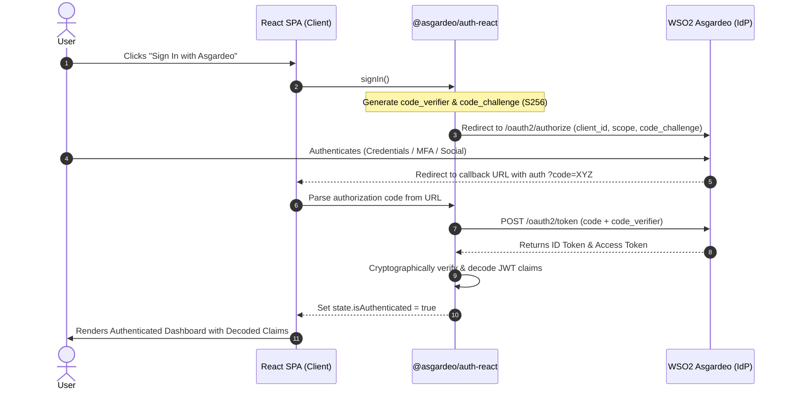

# 🔐 WSO2 Asgardeo OIDC Integration Demo

[](https://react.dev)
[](https://vitejs.dev)
[](https://wso2.com/asgardeo/)
[](https://tailwindcss.com)
[](https://vercel.com)
[](LICENSE)

A production-grade, developer-centric Single Page Application (SPA) demonstrating enterprise **OpenID Connect (OIDC)** and **OAuth 2.0 PKCE** authentication with **WSO2 Asgardeo Identity Cloud**.

Designed and submitted as an official contribution showcase for the **WSO2 Internship Program**.

---

## 🌐 Live Demo & Repository

- **GitHub Repository**: [https://github.com/hifasahamath/wso2-asgardeo-react-auth.git](https://github.com/hifasahamath/wso2-asgardeo-react-auth.git)
- **Live Production URL**: *[Deploying to Vercel — Placeholder: `https://wso2-asgardeo-react-auth.vercel.app`]*

---

## 📸 Application Previews

### 1. Landing Page & Login CTA
<!-- Replace with actual captured screenshot -->
```markdown
[Screenshot 1: Landing Page & Login CTA]
```

*(Modern dark-slate developer landing page with PKCE highlights and Asgardeo sign-in)*

---

### 2. Asgardeo Hosted Login Screen
<!-- Replace with actual captured screenshot -->
```markdown
[Screenshot 2: Asgardeo Hosted Login Screen]
```

*(Secure authentication prompt hosted on WSO2 Asgardeo cloud infrastructure)*

---

### 3. Authenticated Dashboard & Decoded Claims
<!-- Replace with actual captured screenshot -->
```markdown
[Screenshot 3: Authenticated Dashboard & Decoded Claims]
```

*(Live user profile card and interactive JSON inspector for decoded OIDC token claims)*

---

## 🏛️ Authentication Architecture Flow

The application implements the **Authorization Code Flow with Proof Key for Code Exchange (PKCE)** (RFC 7636), ensuring complete protection against authorization code interception attacks without requiring client secrets in browser single-page applications.



---

## ✨ Key Features

- 🛡️ **Standards-Compliant OIDC & OAuth 2.0**: Native PKCE implementation via the official `@asgardeo/auth-react` SDK.
- 🎨 **Developer-First Aesthetics**: Sleek dark-mode interface with WSO2 brand accents, glassmorphism cards, and Lucide developer icons.
- 🔍 **Interactive Token & Claims Inspector**: View decoded JWT claims (`sub`, `iss`, `aud`, `exp`, `iat`) with one-click clipboard copy.
- ⚡ **Zero-Error Fallback UX**: Graceful developer guidance screen when environment variables are unconfigured, preventing blank white screens.
- 🔄 **Silent Token Renewal**: One-click session refreshing directly through Asgardeo's token endpoints.
- 🚀 **Zero-Configuration Vercel Deployment**: Client-side routing rewrites configured via `vercel.json` to prevent 404s on browser reloads.

---

## 📁 Project Structure

```
├── .env.example              # Sample environment variable template
├── .env.local                # Local environment secrets (ignored by Git)
├── vercel.json               # Vercel SPA routing rewrite rules
├── package.json              # Project dependencies and build scripts
├── vite.config.js            # Vite bundler configuration
├── tailwind.config.js        # Custom WSO2 & Asgardeo color themes
├── postcss.config.js         # PostCSS plugins
├── index.html                # Entry HTML shell with Inter & JetBrains Mono fonts
└── src/
    ├── main.jsx              # App entrypoint, AuthProvider, and config guard
    ├── App.jsx               # Orchestrator for loading, auth, and dashboard states
    ├── index.css             # Tailwind base, utilities, and custom scrollbars
    └── components/
        ├── Navbar.jsx        # Sticky top bar with live connection status
        ├── LoginCard.jsx     # Unauthenticated landing page & sign-in CTA
        ├── Dashboard.jsx     # Authenticated user view & action controls
        ├── TokenViewer.jsx   # Interactive JSON claims inspector & copy tool
        └── LoadingSpinner.jsx # Animated dual-ring Asgardeo loading indicator
```

---

## 🛠️ Step-by-Step Installation & Local Setup

### 1. Clone the Repository
```bash
git clone https://github.com/hifasahamath/wso2-asgardeo-react-auth.git
cd wso2-asgardeo-react-auth
```

### 2. Install Dependencies
```bash
npm install
```

### 3. Configure Environment Variables
Copy `.env.example` to `.env.local`:
```bash
cp .env.example .env.local
```

Populate the values from your WSO2 Asgardeo Console:
```env
VITE_ASGARDEO_CLIENT_ID=your_asgardeo_client_id
VITE_ASGARDEO_BASE_URL=https://api.asgardeo.io/t/your_org_name
VITE_ASGARDEO_REDIRECT_URL=http://localhost:5173
VITE_ASGARDEO_POST_LOGOUT_URL=http://localhost:5173
```

### 4. Run Development Server
```bash
npm run dev
```
Open [http://localhost:5173](http://localhost:5173) in your browser.

---

## ⚙️ WSO2 Asgardeo Console Configuration Guide

Follow these steps to register your Single Page Application in WSO2 Asgardeo:

1. **Sign in to Asgardeo Console**: Navigate to [https://console.asgardeo.io](https://console.asgardeo.io).
2. **Create Application**:
   - Go to **Applications** &rarr; click **+ New Application**.
   - Select **Single-Page Application (SPA)**.
   - Enter an application name (e.g., `WSO2 Asgardeo React Auth`).
3. **Configure Protocol Settings**:
   - Under **Authorized Redirect URLs**, add:
     - Development: `http://localhost:5173`
     - Production (Vercel): `https://your-deployment-name.vercel.app`
   - Under **Allowed Origins**, add:
     - Development: `http://localhost:5173`
     - Production: `https://your-deployment-name.vercel.app`
4. **Obtain Credentials**:
   - Copy your **Client ID** into `VITE_ASGARDEO_CLIENT_ID`.
   - Your **Base URL** is `https://api.asgardeo.io/t/<your-organization-name>`.

---

## 🚢 Deploying to Vercel

This repository includes a pre-configured `vercel.json` file for single-page routing:

```json
{
  "rewrites": [
    {
      "source": "/(.*)",
      "destination": "/index.html"
    }
  ]
}
```

### Deployment Steps:
1. Push your repository to GitHub.
2. Import the project in [Vercel Dashboard](https://vercel.com/new).
3. Under **Environment Variables**, add:
   - `VITE_ASGARDEO_CLIENT_ID`
   - `VITE_ASGARDEO_BASE_URL`
   - `VITE_ASGARDEO_REDIRECT_URL` (set to your Vercel URL e.g. `https://your-app.vercel.app`)
   - `VITE_ASGARDEO_POST_LOGOUT_URL` (set to your Vercel URL e.g. `https://your-app.vercel.app`)
4. Click **Deploy**.
5. Remember to copy your Vercel deployment URL back into the Asgardeo Console's **Authorized Redirect URLs**.

---

## 🔒 Security Best Practices Implemented

- **PKCE (Proof Key for Code Exchange)**: Cryptographically binds token exchange to the originating client session without exposing secrets.
- **State Parameter Validation**: Defends against Cross-Site Request Forgery (CSRF) across redirects.
- **In-Memory Token Handling**: Tokens are stored within SDK memory state and refreshed transparently without persistent localStorage exposure vulnerabilities.
- **Graceful Error Recovery**: Prevents client-side white-screens and gracefully alerts developers on configuration discrepancies.

---

## 📜 License

This project is open source and available under the [MIT License](LICENSE).
